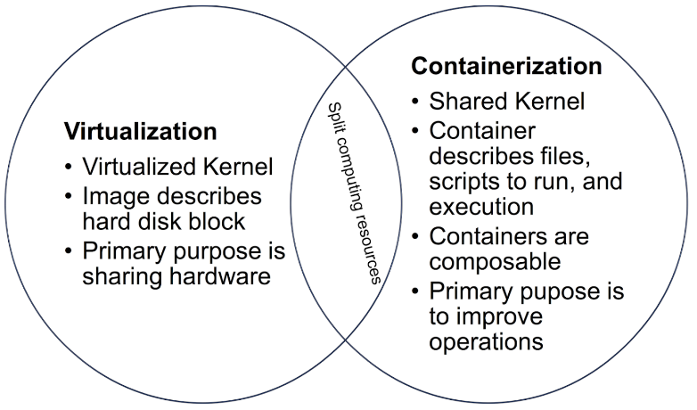
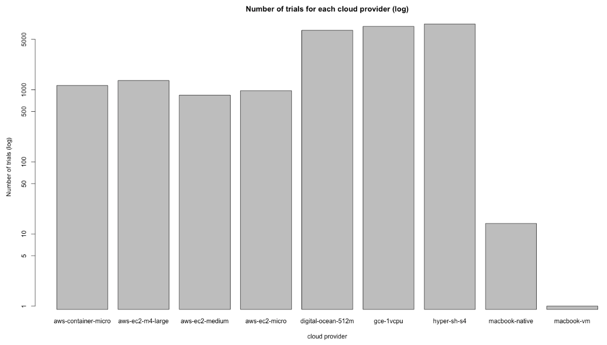
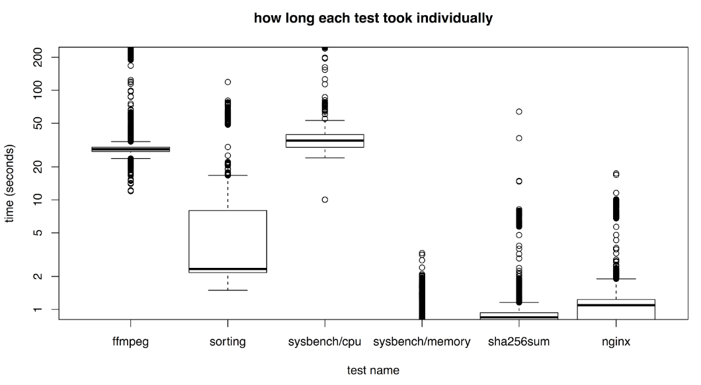

title: "Guest Blog Post: Hyper.sh comes out best value in Cloud Computing Shootout"
date: 2017-05-17 17:00:00 +0200
author: Andy Chase
tags:
    - Docker
    - Value
    - Container
    - Hyper
preview: One of my professors at my alma mater thought that Amazon's or Google's container service would run fastest (and be the best value) because they use container technology. Why didn't that turn out to be true?

---

<iframe width="900" height="800" frameborder="0" scrolling="no" src="https://plot.ly/~andychase/282.embed"></iframe>

The chart above is a box plot showing cloud providers and how well they performed when scaled by cost per hour. *Hyper.sh turned out the best!* (It's lowest on the chart because it's the cheapest essentially).

Figuring out how much using the cloud costs is not simple. As a project I wanted to look at different Cloud Providers and independently measure the performance of running several different test programs to see which one performs the best.

**Hypothesis:** One of my professors at my alma mater thought that Amazon's or Google's container service would run fastest (and be the best value) because they use container technology. Why didn't that turn out to be true?
Who am I?

My name is Andy Chase and I'm a freelance programmer working on building and advising startups to make the world a better place.

My website: [https://andychase.me/](https://andychase.me/)

Github: [https://github.com/andychase](https://github.com/andychase)

Upwork: [https://www.upwork.com/freelancers/~01dbdbcc5a2c375fda](https://www.upwork.com/freelancers/~01dbdbcc5a2c375fda)

# What is Hyper.sh?

Basically Hyper.sh is a cloud provider - they have a warehouse of computers and they rent them out cheap. No matter who you are, it's always great when you can use someone else's warehouse instead of buying your own.

Hyper.sh sets themselves apart from their huge competitors by being focused completely on containers. If you know how to use docker on your local machine then you already know how to use Hyper.sh.

## So why aren't AWS-Container and GCE faster since they also use containers?

My professor figured the cloud providers that use containers should be faster because containers split computing resources using the Kernel so there's no virtualization overhead. In reality, I found out that AWS and GCE run their container engines on top of a virtualized kernel so there's no real performance benefit there.

It might be confusing but containers are really used more for convenience than as a performance tool.

Hyper.sh is an exception here since they were the only provider I found that provided bare metal containerization and they did end up being the best value (barely). So my professor was right after all in a way.

Venn diagram for fun:

## More details about that performance chart above

### The tests I ran

I set up a script to run and time a bunch of different programs:

* [ffmpeg](https://ffmpeg.org/) -- time to decode/encode 30 seconds of a media file
* [sorting](https://en.wikipedia.org/wiki/Sort_(Unix)) -- time to sort the lines of a ~100mb book, “War and Peace” 32 times
* [sysbench](https://github.com/akopytov/sysbench)/cpu  -- time to calculate all prime numbers up to 20,000
* sysbench/memory -- time to run memory mutex benchmark on sysbench
* sha256sum -- time to hash ~100mb book, “War and Peace” 32 times
* [nginx](https://www.nginx.com/) -- time to process 10,000 static http requests

I ran the tests on [Amazon Web Services](https://aws.amazon.com/) micro, medium, and large instances, [Google Container Engine](https://cloud.google.com/container-engine/), [DigitalOcean](https://www.digitalocean.com/), [Hyper.sh](https://hyper.sh/), and a few runs locally on my machine. 

Then I left the scripts running for a few days and came back to see the results!

After that I scaled the costs according to this handy table:

| Cloud Provider | Cost per hour |
|---|---|
| digital-ocean-512m | $0.0070 |
| hyper-sh-s4 | $0.0072 |
| aws-container-micro | $0.0120 |
| aws-ec2-micro | $0.0120 |
| aws-ec2-medium | $0.0470 |
| gce-1vcpu | $0.0475 |
| macbook-native | $0.0494 |
| macbook-vm | $0.0494 |

Here are the overall averages split up by the actual test. I used [Student's T](https://en.wikipedia.org/wiki/Normalization_(statistics)#Examples) score normalization so the different tests could be compared.

<iframe width="900" height="800" frameborder="0" scrolling="no" src="https://plot.ly/~andychase/279.embed"></iframe>

More charts can be found in my [project's slideshow.](https://docs.google.com/presentation/d/1pUvdRFIY5TF_1sXisPqB0K3vdHwVgmtk5HmMS70_X5c/edit?usp=sharing)

# Conclusion: Does any of this really matter?

The first chart shows how actually very close all cloud service providers are in terms of value. A few standard deviations of performance will probably not make or break your project or business.

The real cost of cloud computing is staffing costs. Cloud providers can either save you a lot of time or cost you dearly if setting one up becomes too complex and things keeps breaking.

If your organization lives and breathes containers, Hyper.sh does stand out as a provider that focuses purely around that paradigm and ends up being a good value. But what if you need specialized services like managed databases, managed dns, managed email, etc? In that case would need to look at combining Hyper.sh with other mananged services. (**NOTE: Be on the look out for said services coming soon!**)

## More Information & Acknowledgements

Thanks to Brian James ([hensonb@oregonstate.edu](mailto:hensonb@oregonstate.edu)) and Samuel Jacobs ([jacobssa@oregonstate.edu](mailto:jacobssa@oregonstate.edu)) for their contributions to the project. The project was completed for ECE/CS 476 Winter 2017 taught by Dr. Bechir Hamdaoui ([hamdaoui@eecs.oregonstate.edu](hamdaoui@eecs.oregonstate.edu)).

Project Slideshow here: [ECE/CS 476 Project Presentation](https://docs.google.com/presentation/d/1pUvdRFIY5TF_1sXisPqB0K3vdHwVgmtk5HmMS70_X5c/edit)

Project Report here: [ECE/CS 476 Project Report](https://drive.google.com/file/d/0B6FTBa9iYPrnd1FHelVZc3UzbndwVTBNeFRlS3BydFBuUjJZ/view)

Data here: [ECE/CS 476 Project Data](https://docs.google.com/spreadsheets/d/1HliNBW7mMWA8q1zb4pXa_PtbftxHv2PAo31puax4pm4/edit?usp=sharing)

R Script: [ECE/CS 476 Project R Script](https://gist.github.com/andychase/8d64812b75fa1489eccc34edd9cf6a73)