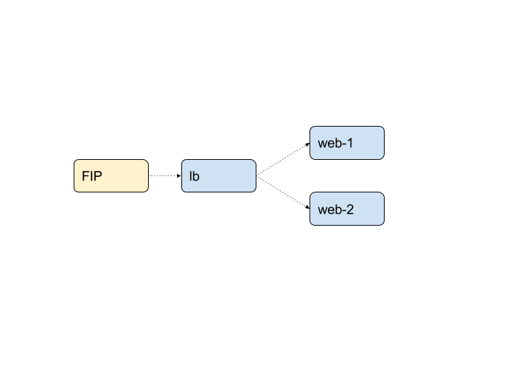

title: "Hyper Use Case Week - Part 2: Load balancer with two web servers"
date: 2016-05-05 17:00:00 +0100
author: hyper
preview: This is part of a 4 part series about the use cases that we've seen people using on Hyper since we opened our public beta on April 4th 2016.

In [part 1](https://blog.hyper.sh/hyper-use-case-week-part-1-web-app-with-a-database.html) we looked at the bread and butter of web development, the stateful web app. In this part we will look at another classic use case: a load balancer in front of two web servers.

---

This is part of a 4 part series about the use cases that we've noticed people using on Hyper since we opened our [public beta](https://console.hyper.sh/register) on April 4th 2016.

In [part 1](https://blog.hyper.sh/hyper-use-case-week-part-1-web-app-with-a-database.html) we looked at the bread and butter of web development, the stateful web app. In this part we will look at another classic use case: a load balancer in front of two web servers.

As we said in the first post these _"...use cases are not groundbreaking, but what we love to see is the ease and speed with which people are getting up and running."_

So let's get started!

### Use Case 2 - Load balancer with two web servers

It happens all the time. Demand on your application is starting to increase and you'd like to horizontally scale your backend.

Simple enough; deploy two web servers, deploy the load balancer, point the load balancer at the web servers, stick a public IP on the load balancer and you're golden!



#### How do I do it?

It's not rocket science but [registered](https://console.hyper.sh/register) Hyper_ users are achieving this deployment in record time. Here's how:

``` shell
hyper run -d --name web-1 hyperhq/webapp:host python app.py
hyper run -d --name web-2 hyperhq/webapp:host python app.py
hyper run -d --name lb --link web-1 --link web-2 dockercloud/haproxy
FIP=$(hyper fip allocate 1)
hyper fip associate $FIP lb
curl $FIP:80
> Hello my host name is: de380811142a
curl $FIP:80
> Hello my host name is: 32d28908d30a
> Hello: linked database is "tcp://<ip_of_db>"
```

Obviously this is a Python web app, but if your application runs in a container, it will run on Hyper_.

#### So what?

This may be no biggy for you anyway. You already provisioned your virtual machines, set up the firewall rules and attached public IPs. Maybe you went ahead and installed scheduling and orchestration tooling.

Sure, then you can go ahead and deploy this in the same time, but you first had to do all that **and now you have to maintain it all**.

With Hyper_ the longest part of the use case is signing up for the public beta. Why not get started now? [https://console.hyper.sh/register](https://console.hyper.sh/register)

**Next** check out part 3 of this series; [persisting state between redeploys using a  volume.](https://blog.hyper.sh/hyper-use-case-week-part-3-volume-snapshot-and-restore.html)

Questions? Drop us a mail at [contact@hyper.sh](mailto:contact@hyper.sh).
