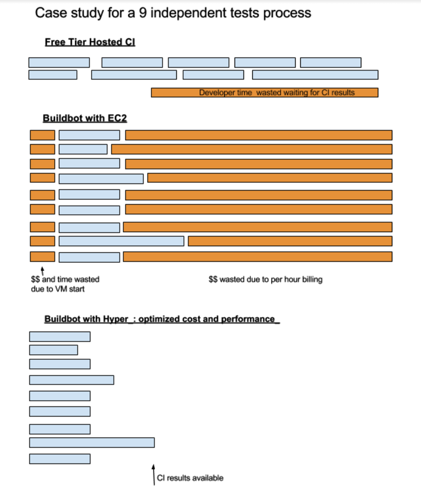

title: "Serverless CI - Hyper.sh integration for Buildbot"
date: 2016-10-20 20:00:00 +0800
author: hyper
tags:
    - Container
    - Docker Hosting
    - Buildbot
    - Continious Integration
    - Serverless
preview: Via an integration with Hyper.sh, version 0.9.1 of BuildBot, the open source Continuous Integration (CI) framework, will include support for ‘serverless CI’. Buildbot is used for CI by many large open source projects including OpenVPN, the Python language and the Perl language, mostly because the tool caters very well to teams who have ‘outgrown’ Drone, Travis, AppVeyor or similar entry-level hosted CI tools.

---

Via an integration with Hyper.sh, version 0.9.1 of BuildBot, the open source Continuous Integration (CI) framework, will include support for ‘serverless CI’.

Buildbot is used for CI by many large open source projects including OpenVPN, the Python language and the Perl language, mostly because the tool caters very well to teams who have ‘outgrown’ Drone, Travis, AppVeyor or similar entry-level hosted CI tools.

If you just want to jump straight in, you can follow the tutorial [here.](https://hyper.sh/howto/how-to-use-hyper.sh-to-deploy-your-buildbot.html)

## CI headaches

Many teams find themselves facing a few recurring challenges with CI; cost, maintenance and security.

“Buildbot is a Continuous Integration Framework that lets you implement the exact process you need unlike the generic processes supported by hosted CI. But this is at the price of building and maintaining your own infrastructure for the build cluster. It takes your attention off the main goal of developing software.”, says Pierre Tardy, Tech Lead on Buildbot.

“Furthermore”, Pierre explains “we can’t just go ahead and build every pull request in our own infrastructure as that would make us vulnerable to attackers.” Indeed, as the CI’s job is to test the code of open-source contributors, this basically leaves the machine running that code completely open.

“That leaves us with a tricky choice.”, he continues, “Either we manually sanity check the pull requests before we build them which is time consuming, or we spin up a new VM for every build job, which is prohibitively expensive and slow.”

Buildbot’s integration with Hyper.sh addresses all of the above.

## Serverless CI with Hyper.sh

Hyper.sh is a container-native docker hosting service. 

Different from traditional IaaS and CaaS hosting providers, Hyper.sh does not employ VM clusters. Instead Docker containers are the only object that users work with.

Hyper.sh's secret sauce is its docker container runtime technology, which combines VM-level isolation with the speed and immutability of a container, allowing multi-tenant containers to run safely on the same physical host.

Whenever a new build job is started in Buildbot the Hyper.sh plugin takes care of spinning up a Hyper.sh container in a matter of seconds. The build job runs in a container, which takes advantage of Hyper.sh hypervisor level isolation, and delivers the build results back to the Buildbot server.

The new integration also supports parallelisation which massively reduces build times when building against multiple targets. Buildbot themselves saw a 300% speed increase in their own builds.

What you get is fast, parallelised, secure builds that due to Hyper.sh’s tiny image sizes also provide massive cost reductions.

“We estimated costs for builds” says Pierre “and thanks to the per second billing Hyper came in around 10 times cheaper than expected!”

Buildbot's findings are illustrated in the diagram below and that’s why we’re calling this ‘Serverless CI’. Apart from the Buildbot master itself you only pay when you’re building and the integration with Buildbot is seamless. After configuring some global settings, the rest works out of the box.

__The Hyper_ integration with Buildbot is available Buildbot 0.9.1.__

Want to get started now? Check the 'Getting Started' section at the bottom of the post.
  

> ## Serverless CI with Jenkins?
>We're also working on a Hyper.sh plugin to provide serverless Jenkins CI. Keep an eye on [twitter](https://twitter.com/hyper_sh) for more news coming soon.

## Getting Started

If you'd like to get started straight away [sign-up for Hyper.sh here](https://hyper.sh/), check out [Buildbot here](http://buildbot.net/), and follow the full Hyper.sh + Buildbot tutorial [here](https://hyper.sh/howto/how-to-use-hyper.sh-to-deploy-your-buildbot.html).

Any questions? Get in touch on [talk@hyper.sh](mailto:talk@hyper.sh)

