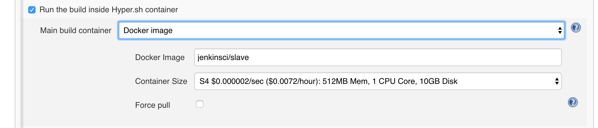
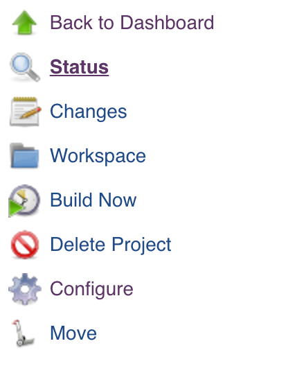
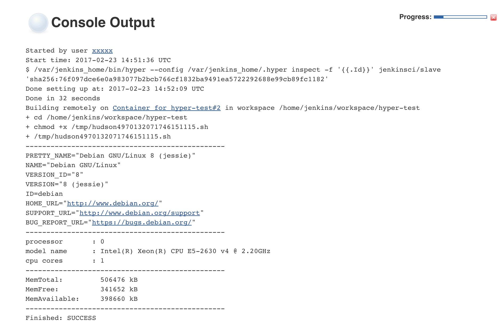

title: Serverless CI - The Hyper.sh plugin for Jenkins
date: 2017-02-23 19:00:00 +0100
author: hyper
tags:
    - Docker
    - Jenkins
    - Container
    - Serverless
    - Continuous Integration
    - Continuous Delivery

preview: Jenkins is the market leader for CI/CD workloads and uses a master/slave configuration for builds. Now you can use the Hyper.sh plugin to get per-second billed 'serverless' build slaves.

---

## What is Hyper.sh?

[Hyper.sh](https://hyper.sh/docker-hosting) is a container-native cloud service. With Hyper.sh you do not have to maintain a VM cluster and you can still use the same Docker tools, like Docker Compose, that you're used to using locally.

Hyper.sh’s secret sauce is its container runtime technology, which combines VM-level isolation with the speed and immutability of a container, making using and deploying containers to production as simple as using Docker on your laptop.

## Why run Jenkins builds on Hyper.sh?

Jenkins is the market leader for CI/CD workloads and uses a master/slave configuration for builds. Sometimes this means that you end up with a lot of VMs that you need to manage, patch and generally worry about. There are some plugins for auto-scaling (EC2 Plugin, Digital Ocean plugin) but they are VM based and therefore slow. Do you want to wait 1-2 minutes for a VM that then runs a 3 minute build job and then be billed for a full hour? Probably not.

The Hyper.sh plugin allows users to launch containerized on-demand Jenkins build slaves. This presents a number of benefits:

 * Faster start times: 3~10 seconds vs. 1-2 minutes elsewhere
 * Lower Cost: per second billing vs. hourly pricing
 * Easy to use: no changes to your existing workflow

 Convinced? Great, let's get started.

## Getting Started

We're going to assume that you've already signed up to Hyper.sh but if not check out the quick start guide right [here](https://docs.hyper.sh/GettingStarted/index.html).

### Deploy the Jenkins master

> Please note that we're using a pre-built version of Jenkins that we call Hykins. This is just a vanilla Jenkins master with some plugins and configuration installed for you. If you'd like to start from a vanilla Jenkins image please see the Dockerfile for Hykins [here.](https://github.com/hyperhq/hykins/blob/master/Dockerfile)

> Lastly, in this example we're running the Jenkins master on Hyper.sh, but you could also run the master elsewhere and just use Hyper.sh to supply build slaves.

Now we need to deploy the Jenkins master, which requires only 3 commands in Hyper.sh:


```
// launch a jenkins server container
$ hyper run --name hykins -d -P \
  --size=m1 \
  -e ADMIN_USERNAME=xxxxx \
  -e ADMIN_PASSWORD=xxxxx \
  -e ACCESS_KEY=<YOUR HYPER ACCESS KEY> \
  -e SECRET_KEY=<YOUR HYPER SECRET KEY> \
  hyperhq/hykins

// attach a public ip to the container
$ hyper fip allocate 1
<YOUR FIP APPEARS HERE>
$ hyper fip attach <YOUR FIP> hykins
```
> You can find your ACCESS KEY and SECRET KEY in ~/.hyper/config.json after installing the CLI

You can now connect to the Jenkins master on `<YOUR FIP>:8080`

### Create a new build job

* Create a "Freestyle project"

* Check "Run the build inside Hyper.sh container"
  * Docker Image: jenkinsci/slave
  * Container Size: S4




* Add build step "Execute shell"
  * Command:

```
set +x
echo ------------------------------------------------
cat /etc/os-release
echo ------------------------------------------------
cat /proc/cpuinfo | grep -E '(processor|model name|cpu cores)'
echo ------------------------------------------------
cat /proc/meminfo | grep ^Mem
echo ------------------------------------------------
```
### Trigger build

In this tutorial we’ll trigger the build manually by clicking on 'Build Now' on the project page, but normally you’d configure an SCM to trigger the build.



### View results



## Summary

And that's it! You just ran a build on a per-second billed container that cleaned up after itself leaving you with zero maintenance overhead.

**You may have noticed** that the build was a bit slow the first time round. That's because Hyper.sh needed to pull the slave image. Try again and you'll see that it's significantly faster!

### Final note on build workspaces

It’s common with some teams using long running Jenkins slaves to use the ‘Workspace’ tab in the GUI to debug the results of a build. With Serverless CI this is not possible because the build container is destroyed after each build.

Therefore if you would like inspect the post-build state (or keep actual build artifacts of course) we recommend that you use the ‘Archive the artifacts’ options in the ‘Post-build Actions’ section of the build page.

### Where can I learn more or get help?

That’s all for now. For more info, please visit [https://github.com/hyperhq/hykins.](https://github.com/hyperhq/hykins)

If you have any feedback, you can contact us in any of the following ways.

[Twitter](https://twitter.com/hyper_sh), [Slack](https://slack.hyper.sh/), [Forum](https://forum.hyper.sh/), [Mail](mailto:talk@hyper.sh)

Happy Hacking!
The Hyper Crew
